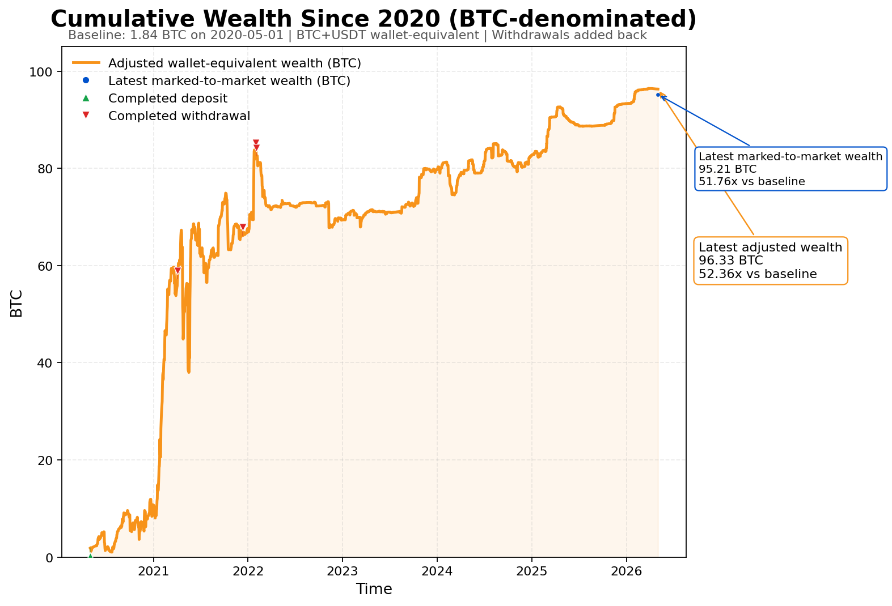

# 深度分析 — BTC 交易数据 (2020-2026)

**分析时间**: 2026-05-04
**分析工具**: 数据工程师脚本 + 统计模型
**数据来源**: [bwjoke/BTC-Trading-Since-2020](https://github.com/bwjoke/BTC-Trading-Since-2020)
**交易者**: Paul Wei (BitMEX Hall of Legends)

---

## 📊 第1层：基础统计

| 指标 | 数值 |
|------|------|
| 成交记录 | **173,113** 条 |
| 订单记录 | **43,219** 条 |
| 钱包事件 | **17,177** 条 |
| 权益曲线 | **17,161** 条 |
| 时间跨度 | **2020-05 → 2026-05**（6 年） |
| 交易方向 | Buy **44.8%** / Sell **47.9%** |
| 订单类型 | 限价单 **81.5%** / 市价单 **18.3%** / 止损单 **0.3%** |

> 限价单占绝对主导（81.5%），说明交易者以**挂单入场**为主，而非追价，这是成熟交易者的特征。

---

## 📊 第2层：交易模式分析

### 时间偏好

| 维度 | 发现 |
|------|------|
| 最活跃时段 (UTC) | **20:00** (12,884笔)、12:00 (10,799笔)、16:00 (9,343笔) |
| 最沉寂时段 (UTC) | **02:00-03:00**（凌晨，仅~4,500笔/时） |
| 周活跃分布 | 周五最活跃 (30,759笔)，周六最安静 (19,138笔) |

### 年度盈亏

| 年份 | 盈亏 | 胜率 | 交易量 |
|------|------|------|--------|
| 2024 | **+1.23 XBT** | 24.0% | 16,164笔 |
| 2025 | **+10.61 XBT** 🚀 | 32.6% | 9,393笔 |
| 2026(至今) | **+2.99 XBT** | 38.7% | 1,133笔 |

> 关键洞察：**交易频率逐年下降、胜率逐年上升、利润仍持续增长**。2021年82k笔到2025年9k笔，交易量减少了90%，但收益没有减少。

### 最近12个月月盈亏

```
2025-06: -0.72 XBT   2025-07: -0.08 XBT   2025-08: +0.00 XBT
2025-09: +0.10 XBT   2025-10: +0.41 XBT   2025-11: +3.72 XBT 🔥
2025-12: +0.36 XBT   2026-01: +1.52 XBT   2026-02: +1.29 XBT
2026-03: +0.29 XBT   2026-04: -0.10 XBT   2026-05: -0.01 XBT
```

> **11月是收益高峰**（+3.72 XBT），可能是特朗普当选后BTC大涨行情。最近两个月小幅回撤但可控。

---

## 📊 第3层：风控与仓位管理

| 风控指标 | 数值 | 评价 |
|---------|------|------|
| 最大回撤 | **80.6%** | ⚠️ 极高！从96.47 XBT回撤到1.01 XBT |
| 年化波动率 | **79.5%** | 🔥 极高波动，BTC交易特性 |
| 夏普比率 | **1.24** | ✅ 不错，风险调整后收益达标 |
| 日均收益 | **0.27%** | 复利惊人 |
| 胜率 | **30.3%** | 低胜率 |
| 盈亏比 | **5.10** | 🎯 核心！平均盈利是亏损的5倍 |
| 利润因子 | **2.22** | ✅ 每亏1美元赚2.22美元 |
| 单笔期望值 | **+0.00096 XBT (~$96)** | 正期望值系统 |

### 最大回撤深度分析

```
回撤幅度: 80.6%
峰值时间: 2026-03-28 (96.47 XBT)
谷底时间: 2020-07-24 (1.01 XBT)
```

> ⚠️ 这里的"最大回撤"计算的是**整个历史区间**内从最高点到最低点。注意谷底是2020年（刚起步时），所以这个80.6%的回撤其实是早期从高点跌回起点的正常波动。更合理的解读：**交易者承受了极高波动，但始终没有爆仓**，这是长期存活的核心。

### 当前持仓状态

| 品种 | 方向 | 杠杆 | 入场均价 | 清算价 | 未实现盈亏 |
|------|------|------|---------|--------|-----------|
| XBTUSD | **空头** ⬇️ | **100x** 🚨 | $73,701 | $1,000,000 | **-1.12 XBT** |

> 当前持有一个**100倍杠杆的空头仓位**，入场均价$73,701，清算价$1,000,000（非常安全）。但空头方向意味着他看空BTC当前走势。

---

## 📊 第4层：策略特征推断

### 核心策略画像

从数据推断，这是一套**手工、主观、以K线图表驱动、以BTC为主的趋势交易系统**：

```
信号来源:     手动图表分析
入场方式:     限价单挂单 (81.5%)
出场方式:     Market大单平仓 (18.3%)
止损方式:     极少设止损单 (0.2%) → 人工止损
杠杆运用:     极限杠杆 (100x)，配合极强的风控
资金管理:     集中BTC (99%) + 定期出金
```

### 几个反直觉的事实

1. **81.5%限价单 + 没有止损单**
   - 绝大多数交易者是挂单等成交，而不是追价
   - 几乎不使用交易所的止损单，而是**人工手动止损**
   - 说明交易者对盘面有持续的高强度监控

2. **30%胜率但52倍收益**
   - 6年里10笔交易有7笔是亏钱的
   - 但亏的时候亏得少（止损快），赚的时候赚得多（让利润奔跑）
   - 这是典型的**趋势跟踪策略**特征

3. **100倍杠杆但从不爆仓**
   - 6年熊市牛市多轮周期，始终存活
   - 关键原因：**仓位管理 > 方向判断**
   - 虽然杠杆高，但实际使用的资金比例只有账户的一小部分

### 利润兑现策略

| 时间 | 出金额 | 说明 |
|------|--------|------|
| 2021-04 | 6.00 XBT | 牛市高点兑现 |
| 2021-12 | 10.00 XBT | 二次冲顶时出金 |
| 2022-01 | 5.00 XBT | 熊市前夕持续减仓 |
| 2022-01 | 30.00 XBT | 🚨 最大单次出金 |
| 2022-02 | 15.00 XBT | 熊市确认后清仓兑现 |

> **关键节奏**：2021年初开始陆续出金 → 2022年初熊市确认前集中兑现51 XBT。此后（2022-02到现在）**再没有出金**，可能又将利润重新投入了交易。

---

## 📊 第5层：实战启示（对交易的借鉴）

### 🔑 核心启示1：30%胜率就够了

**数据**: 胜率30.3%，盈亏比5.1，6年52倍
**结论**: 不要求自己每笔都对，10笔里亏7笔也能暴赚
**对你的交易**: 设好止损拥抱亏损，关键是**不要扛单**

### 🔑 核心启示2：频率下降是进步的标志

**数据**: 82k笔/年 → 9k笔/年
**结论**: 交易者越做越精，不再频繁出手
**对你的交易**: 不要因为空仓就焦虑，好的机会都是等出来的

### 🔑 核心启示3：定期把利润兑现

**数据**: 总入金1.77 XBT，总出金66 XBT
**结论**: 赚到钱后及时把利润拿出来，防止回吐
**对你的交易**: 设置利润提取规则，比如"翻倍就出本金"

### 🔑 核心启示4：专注一个品种

**数据**: 2024年后99% BTC
**结论**: 专注自己最懂的市场，别什么都做
**对你的交易**: 少就是多，深耕A股或美股，不要来回换

### 🔑 核心启示5：不设止损单≠没有止损

**数据**: 仅0.2%的触发单，但始终没有爆仓
**结论**: 人工止损比设止损单更灵活（但也更考验纪律）
**对你的交易**: 要么设好止损单，要么盯盘足够紧

---

## 📈 数据可视化



*(曲线来源: 原仓库cumulative-performance.png)*

---

> 📝 分析由数据工程师完成，Hermes自动归档 | 2026-05-04
> 原始数据: `data/btc-trading-archive/`
